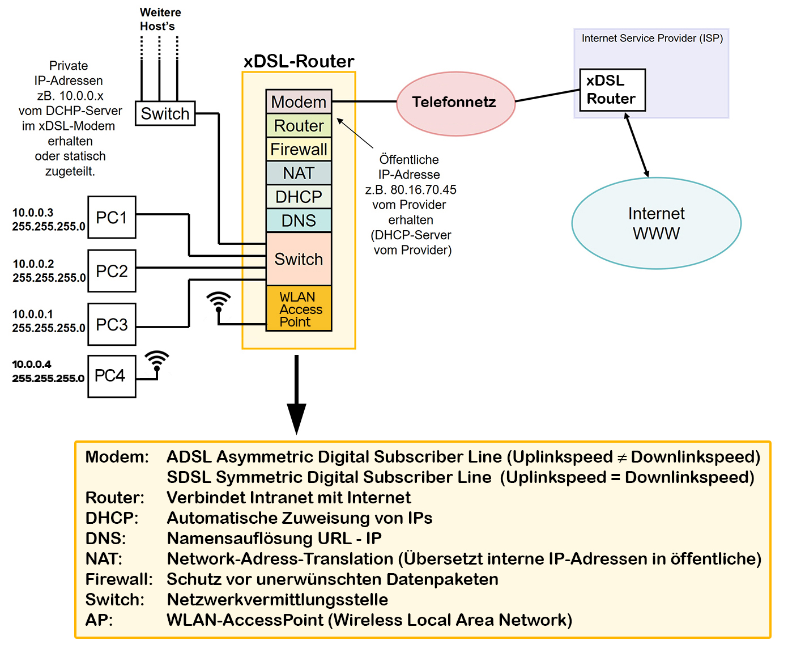
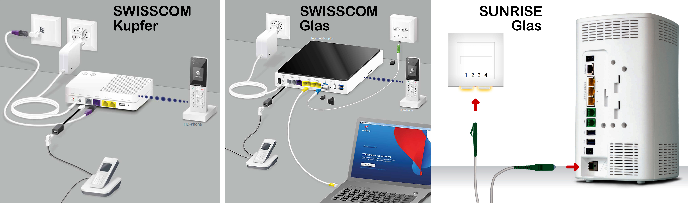

# Teil 2 der Zugang ins Internet 〽

## WWW (World Wide Web)

---

### Begriffe

- **VLAN**: Virtual Local Area Network (virtuelles lokales Netzwerk)
- **LAN**: Local Area Network (lokales Netzwerk)
- **WLAN**: Wireless Local Area Network (drahtloses lokales Netzwerk)
- **SSID**: Service Set Identifier (Netzwerkname)
- **IEEE**: Institute of Electrical and Electronics Engineers (Organisation für Elektrotechnik und Elektronik)
- **DNS**: Domain Name System (Domain Name System)
- **Firewall**: Sicherheitssystem zum Schutz vor unerlaubtem Zugriff
- **Patches**: Aktualisierungen zur Behebung von Softwarefehlern oder Sicherheitslücken
- **WPA2**: Wi-Fi Protected Access 2 (Sicherheitsprotokoll für WLAN-Netzwerke)
- **SISO**: Single Input, Single Output (eine Eingabe, eine Ausgabe)
- **MIMO**: Multiple Input, Multiple Output (mehrere Eingaben, mehrere Ausgaben)
- **MU-MIMO**: Multi-User Multiple Input, Multiple Output (mehrere Benutzer, mehrere Eingaben, mehrere Ausgaben)
- **NAT**: Network Address Translation (Netzwerkadressübersetzung)
- **WAN**: Wide Area Network (Weitverkehrsnetzwerk)
- **DHCP**: Dynamic Host Configuration Protocol (Protokoll zur dynamischen IP-Adresszuweisung)

---

### Router

- Signalaustausch über das Telefonnetz mit xDSL-Modem (ADSL oder SDSL) o 
  - ADSL : Asymmetric Digital Subscriber Line. Uplink weist nicht dieselbe Bandbreite auf – meist langsamer – als der Downlink. o  
  - SDSL : Symmetric Digital Subscriber Line. Uplink und Downlink weisen dieselbe Bandbreite auf. Dies ist z.B. für LAN-WAN-LAN-Verbindungen erforderlich. 
- Signalaustausch über ein Koaxialkabel oder Glasfaseranschluss. 
- Router: Der Router verbindet das Intranet mit der Aussenwelt bzw. routet Datenpakete vom und zum Internet. 
- DHCP-Dienst: Für eine automatische Zuweisung von IP-Adressen an die PC’s. 
- DNS-Dienst: Für die Namensauflösung URL zu IP-Adresse. 
- NAT: Network-Adress-Translation. Übersetzt interne (private) IP-Adressen in eine externe (öffentliche) IP-Adresse und umgekehrt. 
- Firewall: Für einen «einfachen» Schutz vor unerwünschten Datenpaketen. 
- WLAN-Access-Point: Wireless Local Area Network, Drahtloses lokales Netzwerk. 
- Switch: Drahtgebundene Netzwerkvermittlungsstelle 
- USB-Druckeranschluss (Druckerserver) 
- DECT-Schnurlos-Telefonanschlüsse

---

### ISP Auftrag (Internet Service Provider)

*Sie sollen zwei ISP-Angebote (Keine Glasfaser!) für ihren Wohnortevaluieren und die Resultate in einer tabellarischen Aufstellung präsentieren. Klären sie folgendes ab:*

---

#### Fragen

- *Technologie (ADSL, SDSL, VDSL, Glasfaser, Koaxialkabel, Drahtlos?)*

- *Welche Leistung (Datendurchsatzrate Up- und Download) wird zu welchem Preis angeboten? (Best Effort?)*

- *Wird der Router kostenlos mitgeliefert?*

- *Einmalige Gebühren wie z.B. Aufschaltgebühren, Installationskosten etc.*

- *Support, Hotline-Verfügbarkeit, kostenpflichtige (?) Vor-Ort-Servicedienstleistungen*

- *Vertragsdauer, Kündigungsfristen, Ansprechpartner*

- *Netz-Verfügbarkeit (7x24h * 365 Tage?) Wartungsintervalle etc.*

- *Skalierbarkeit (Wenn die Leistung nicht mehr reicht und der «Hahn aufgedreht» werden muss.)*

---

#### ISP-Angebote für den Wohnort Dietikon:

| ISP-Angebot | Technologie   | Leistung (Up/Down) | Preis           | Router           | Einmalige Gebühren        | Support                             | Vertragsdauer | Netz-Verfügbarkeit | Skalierbarkeit      |
|-------------|---------------|--------------------|-----------------|------------------|---------------------------|-------------------------------------|----------------|--------------------|---------------------|
| Sunrise     | VDSL          | 100 Mbit/s / 20 Mbit/s | CHF 59.90 pro Monat | Router inklusive | CHF 0 Aufschaltgebühren   | Hotline verfügbar 7x24h            | 12 Monate      | 24/7 Verfügbarkeit | Möglich, höhere Geschwindigkeiten verfügbar |
| Swisscom    | VDSL          | 200 Mbit/s / 20 Mbit/s | CHF 69.00 pro Monat | Router inklusive | CHF 0 Aufschaltgebühren   | Hotline verfügbar 7x24h            | 12 Monate      | 24/7 Verfügbarkeit | Möglich, höhere Geschwindigkeiten verfügbar |

---

### Unterschied WLAN und VLAN

- **WLAN**:
  - Drahtloses lokales Netzwerk
  - Ermöglicht die kabellose Kommunikation zwischen Geräten über Funkwellen
  - Verwendung von Access Points zur Signalübertragung
  - Häufig für Heimnetzwerke und öffentliche WLAN-Hotspots verwendet

- **VLAN**:
  - Virtuelles lokales Netzwerk
  - Ermöglicht die logische Aufteilung eines physischen Netzwerks in mehrere isolierte virtuelle Netzwerke
  - Segmentation hilft bei der Verbesserung der Sicherheit und Effizienz des Netzwerks
  - Geräte in einem VLAN können untereinander kommunizieren, während die Kommunikation zwischen VLANs über Router oder Layer-3-Switches erfolgt

---

### Lichtwellenleiter-Auftrag: 
- ISP-Anfrage:
  - Angenommen, ich erkundige mich bei meinem ISP, Swisscom, ob an meinem Wohnort Glasfaser verfügbar ist und welche Übertragungsrate angeboten wird.
  - Antwort des ISPs: Ja, an Ihrem Wohnort ist Glasfaser verfügbar mit einer Übertragungsrate von bis zu 1 Gbit/s. Ein Router wird mitgeliefert.
- Evaluierung eines eigenen WAN-Routers:
  - Angenommen, ich suche im Fachhandel nach einem WAN-Router mit WAN-seitigem Glasfaseranschluss.
  - Spezifikationen des ausgewählten Routers:
    - Ethernetstandard bzw. IEEE-Norm: Erfüllt den Standard IEEE 802.3.
    - Maximal erreichbarer Datenübertragungsdurchsatz: Bis zu 10 Gbit/s.
    - WAN-seitiger Steckertyp (Lichtwellenleiter): Unterstützt den Steckertyp LC.
    - Kosten und Verfügbarkeit: Der Router kostet 200€ und ist sofort verfügbar.

