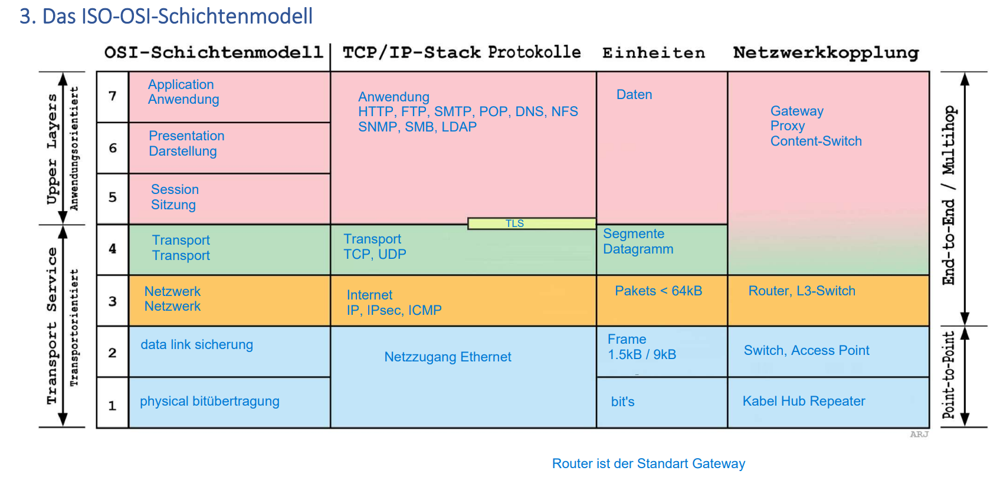

# Teil 5 IP

## Praxis

- switch braucht keine IP Adresse
---

## Aufgabe 1

- Das Bild oben ist mein aufgebautes Netz für die Aufgabe 1, es besteht aus 4 PCs und 2 Switches. Die IPs habe ich statisch gesetzt, wie es in der Aufgabe stand.

- Die IPs für die Laptops sind wie folgt:

  - 192.168.20.1

  - 192.168.20.2

  - 192.168.20.3

  - 192.168.20.4

### Netzwerk überprüfen

- Um zu überprüfen ob die Verbindung zwischen den Laptops besteht, führte ich Pings aus. Als beweis sind unten Screenshots von den Pings vom PC1 aus.

 

## Aufgabe 2

- In der 2. Übung muss man nun die IPs auf DHCP schalten und einen DHCP einbuen.

- Die Configuration für den DCHP sieht so aus, zusätzlich wies ich ich ihm die IP: 192.168.20.1 zu mit der Subnetzmaske 255.255.255.0

### Netzwerk überprüfen

- Zum Uberprüfen machte ich wieder einen Ping von einem PC auf einen anderen.

  

## Aufgabe 3

- Nun mussten wir den DHCP-Server ausschalten und schauen was passiert.

- Die PCs behalteten ihre IPs, und können sich auch immer noch pingen. Sobald man aber einen neue IP-requestet bekommt man keine weil der DHCP aus ist.

- Packet-Tracer hat aber einen Dienst der eine Notfalls-IP zuweist, der sich APIPA nennt.

## Aufgabe 4

- Für Aufgabe 4 sah unser Netzwerk so aus:

- Die IPs: für die Computer sind folgende:

  - PC0: 192.168.10.1

  - PC1: 192.168.10.2

  - PC2: 192.168.20.1

  - PC3: 192.168.20.2

 

 

- Die beiden Subnetzte können sich nicht pingen, da wie der Name es sagt nicht im gleichen Netz sind.

## Aufgabe 5

 

 - Bei der Aufgabe 5 habe ich die genau gleichen IPs gegeben:

    - PC0: 192.168.10.1

    - PC1: 192.168.10.2

    - PC2: 192.168.20.1

    - PC3: 192.168.20.2

- Ebenfalls kann man sich wieder nicht von Subnetz auf das andere Subnetz pingen.

---

### OSI Modell

- Das OSI-Modell (Open Systems Interconnection) ist ein Konzept, das den Aufbau und die Funktion von Netzwerken in sieben Schichten beschreibt.
- Die sieben Schichten sind: Physikalische Schicht, Sicherungsschicht, Netzwerkschicht, Vermittlungsschicht, Transportschicht, Sitzungsschicht und Anwendungsschicht.
- Die Physikalische Schicht behandelt die physische Verbindung und Übertragung von Datenbits über das Netzwerkmedium.
- Die Sicherungsschicht regelt den Datenfluss zwischen direkt benachbarten Netzwerkknoten und erkennt und korrigiert Übertragungsfehler.
- Die Netzwerkschicht ermöglicht die Adressierung und den Routing-Prozess, bei dem Datenpakete zwischen verschiedenen Netzwerken transportiert werden.
- Die Vermittlungsschicht stellt den End-to-End-Datenaustausch über mehrere Netzwerke hinweg sicher und kontrolliert den Datenfluss.
- Die Transportschicht gewährleistet eine zuverlässige Datenübertragung zwischen Anwendungen auf den Hosts und behandelt die Segmentierung und Reassemblierung von Daten.
- Die Sitzungsschicht ermöglicht die Kommunikation und Synchronisation zwischen verschiedenen Anwendungen auf unterschiedlichen Geräten.
- Die Anwendungsschicht bietet Dienste und Protokolle für die Interaktion zwischen Anwendungen und Benutzern.
- Das TCP/IP-Protokoll ist ein Netzwerkprotokoll-Set, das auf dem OSI-Modell basiert und in den Schichten Netzwerkschicht (IP) und Transportschicht (TCP) arbeitet.
- Das IP-Protokoll ist verantwortlich für die Adressierung und das Routing von Datenpaketen im Netzwerk.
- Das TCP-Protokoll gewährleistet eine zuverlässige Übertragung von Daten zwischen Anwendungen über das Netzwerk.