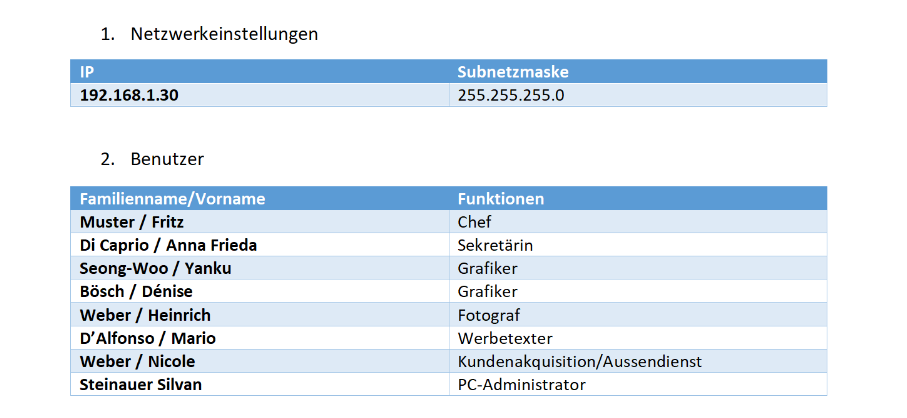
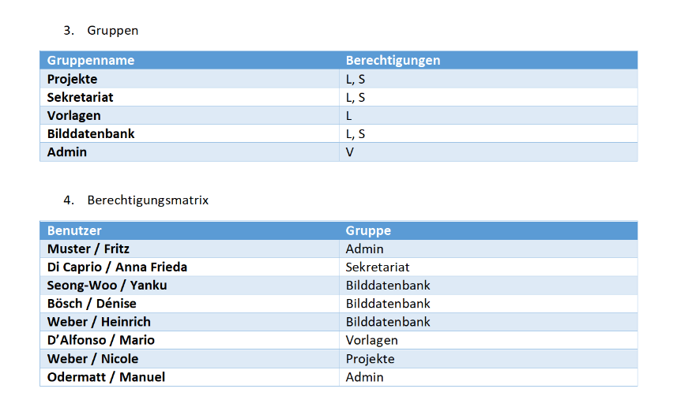

### Installation einer Windows-VM 🏁

**Um eine Windows-Virtual Machine (VM) zu installieren, habe ich folgende Schritte durchgeführt:**

---

1. **Planungsdokument Netzwerkeinstellungen**
   - Ich habe eine IP-Adresse für die VM festgelegt, die den Netzwerkeinstellungen meines Host-Systems entspricht.
   - Die Subnetzmaske für das Netzwerk, in dem die VM betrieben wird, habe ich ebenfalls definiert.
   - Als Standardgateway habe ich das entsprechende Gateway für den Zugriff auf andere Netzwerke festgelegt.
   - Für die DNS-Einstellungen habe ich die geeigneten DNS-Server-Adressen angegeben.

2. **Planungsdokument Benutzer**
   - Ich habe ein Administrator-Konto auf der VM eingerichtet und einen Benutzernamen sowie ein Passwort dafür festgelegt.
   - Zusätzlich habe ich weitere Benutzerkonten erstellt und ihre Zugriffsrechte auf der VM festgelegt.

3. **Planungsdokument Gruppen**
   - Ich habe entschieden, welche lokalen Benutzergruppen auf der VM benötigt werden, wie beispielsweise Administratoren, Benutzer und Gäste.
   - Anschließend habe ich die entsprechenden Benutzer den jeweiligen Gruppen zugeordnet.

4. **Planungsdokument Berechtigungsmatrix mit Freigaben**
   - Für die Steuerung des Zugriffs auf freigegebene Dateien und Ordner habe ich eine Berechtigungsmatrix erstellt.
   - Ich habe angegeben, welche Benutzer oder Gruppen Lese- oder Schreibzugriff auf die Dateien und Ordner haben sollen.
   - Zusätzlich habe ich festgelegt, welche Benutzer oder Gruppen auf freigegebene Drucker zugreifen dürfen.

5. **Testprotokoll mit allen durchgeführten Tests und Resultaten**
   - Während der VM-Installation habe ich den gesamten Installationsprozess dokumentiert, einschließlich der verwendeten Einstellungen und Konfigurationen.
   - Nach der Installation habe ich Tests durchgeführt, um sicherzustellen, dass die Netzwerkeinstellungen ordnungsgemäß funktionieren.
   - Dabei habe ich die Verbindung zur VM und die Netzwerkkonnektivität überprüft.
   - Anschließend habe ich die Benutzerkonten und deren Berechtigungen auf der VM getestet, um sicherzustellen, dass sie wie beabsichtigt funktionieren.
   - Zuletzt habe ich die Datei- und Druckerfreigaben überprüft, um sicherzustellen, dass die Berechtigungen ordnungsgemäß angewendet werden.
   - Ich habe alle durchgeführten Tests dokumentiert und die Ergebnisse festgehalten, um eventuelle Probleme zu identifizieren und zu beheben.

---

# Teil7 Praktische Umsetzung
1. Zuerst machten wir unsere Planung, wie es im Handout auch hiess. Die Planung ist unter Übungen zu finden.
2. Dann setzten wir unsere Planung um, um zu zeigen das wir es wirklich gemacht hatten, sind hier nun ein paar Screenshots.

