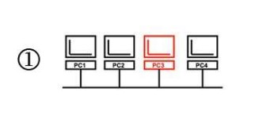
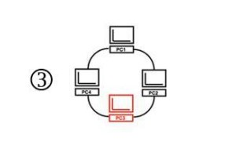
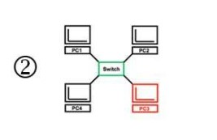
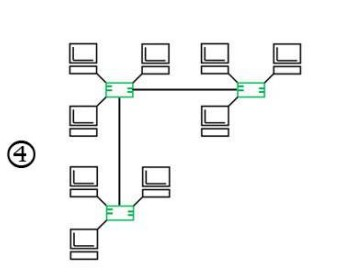
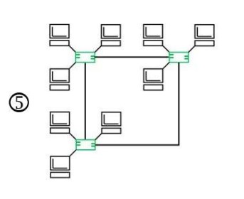
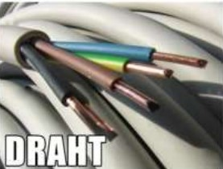
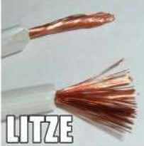
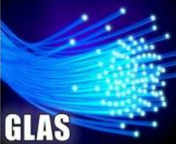
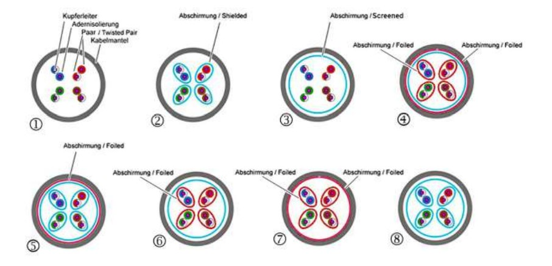
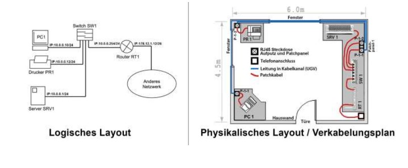

# Teil 1 Kabel

## Simplex/Unidirektional, Half-Duplex/Bidirektional, Duplex/Bidirektional

---

### Netzwerk Komponente

- Router -> Firewall, Accesspoint, DHCP Server, DNS Server, NAT, Switch ist eingebaut in den Router
- Switch
- Drucker
- Clients (Laptop, Drucker, PC)
- Firewall (im Router)
- Switch ist verbunden mit Router, PC, Drucker,
- Laptop etc ist per wireless verbunden
- NAS SRV1 (Server)
- SRV ist mit dem Router oder Switch verbunden
- Steckdose mit WAN Anschluss
- WAN Anschluss ist über Glas oder Kupfer angeschlossen
- -> WAN kostet (Wide Area Network)
- -> WAN funktioniert so, dass es sich mit dem nächst grösseren Netzwerk in Gebäude, Städte oder Länder. 
- vom DHCP kriegt man eine IP Adresse ans Gerät
- DNS (Domain Name System) -> eine Domain ist eine IP Adresse, die umgewandelt wird zu einer URL

- -> Jedes Gerät benötigt eine Adresse (IP) -> Internet Protocoll

---

### Wie funktioniert das heutige LAN? Begründen sie!

Das heutige LAN (Local Area Network) verwendet Ethernet-Technologie und Switches, um Geräte innerhalb eines begrenzten geografischen Bereichs miteinander zu verbinden. Dies ermöglicht eine schnelle und zuverlässige Datenübertragung zwischen den Geräten im Netzwerk.

---

## Netzwerktopologien

*Wie unterscheiden sich die Topologien? (Vor-/Nachteile)*

### Bustopologie

Alle Geräte sind über ein gemeinsames Übertragungsmedium (Bus) verbunden.
- **Vorteile**: Einfache Installation, kostengünstig, geringer Verkabelungsaufwand.
- **Nachteile**: Einzelner Fehlerpunkt kann das gesamte Netzwerk beeinträchtigen, begrenzte Skalierbarkeit, begrenzte Bandbreite bei hoher Auslastung.

### Ringtopologie

Geräte sind in einer Ringstruktur miteinander verbunden, wobei jedes Gerät mit seinen Nachbarn verbunden ist.
- **Vorteile**: Gleichmässige Datenübertragung, gute Auslastung des Netzwerks, einfache Erweiterung.
- **Nachteile**: Einzelner Fehlerpunkt kann den gesamten Ring beeinträchtigen, begrenzte Skalierbarkeit, potenziell hohe Latenz bei vielen Teilnehmern.

### Sterntopologie

Alle Geräte sind mit einem zentralen Knotenpunkt (Switch oder Hub) verbunden.
- **Vorteile**: Einfache Verkabelung, einfache Erweiterung, Fehler in einem Gerät beeinträchtigen nicht das gesamte Netzwerk.
- **Nachteile**: Ausfall des zentralen Knotenpunkts führt zum Ausfall des gesamten Netzwerks, erhöhter Verkabelungsaufwand.

### Baumtopologie

Hierbei werden mehrere Stern-Topologien miteinander verbunden, wobei ein zentraler Knotenpunkt als Wurzel des Baums fungiert.
- **Vorteile**: Skalierbarkeit, gute Auslastung des Netzwerks, ermöglicht die Organisation in verschiedene Ebenen oder Bereiche.
- **Nachteile**: Ausfall des zentralen Knotenpunkts kann das gesamte Netzwerk beeinträchtigen, erhöhter Verkabelungsaufwand.

### Meshtopologie

Jedes Gerät ist direkt mit jedem anderen Gerät im Netzwerk verbunden.
- **Vorteile**: Hohe Redundanz, keine Single-Point-of-Failure, gute Skalierbarkeit.
- **Nachteile**: Hoher Verkabelungsaufwand, hohe Kosten, komplexes Design und Konfiguration.

---

## Draht, Litze und Glas

*Was sind die Vor- und Nachteile der drei unterschiedlichen Fabrikate?
Wo finden sie in der Netzwerktechnik Verwendung? Stichwort: Statische, fixe vs.
dynamische, veränderbare Installation/Verkabelung, Verarbeitung.*

### Draht

**Vorteile**: Einfach zu verarbeiten, kostengünstig.
**Nachteile**: Anfällig für Störungen, begrenzte Reichweite.
Verwendung: Ethernet-Netzwerke.

### Litze

**Vorteile**: Flexibel, einfache Verarbeitung.
**Nachteile**: Anfällig für Störungen, begrenzte Reichweite.
Verwendung: Ethernet-Netzwerke, Telekommunikationsanwendungen.

### Glas

**Vorteile**: Hohe Bandbreite, geringe Störanfälligkeit, grosse Reichweite.
**Nachteile**: Höhere Kosten, anspruchsvollere Installation.
Verwendung: Hochgeschwindigkeitsnetzwerke, Fernübertragung von Daten.

### Zusammenfassung

Draht ist kostengünstig, aber anfällig für Störungen und hat eine begrenzte Reichweite. Litze ist flexibel und einfach zu verarbeiten, aber ebenfalls anfällig für Störungen und hat eine begrenzte Reichweite. Glasfaser bietet eine hohe Bandbreite, ist weniger störanfällig und ermöglicht grosse Reichweiten, aber die Installation ist anspruchsvoller und teurer. In der Netzwerktechnik werden alle drei Materialien verwendet, wobei Draht und Litze in Ethernet-Netzwerken und Glasfaser in Hochgeschwindigkeitsnetzwerken und für Fernübertragungen eingesetzt werden.

---

## Störeinflüsse abwehren

### Was kann die Kommunikation stören? Und was kann dagegen helfen?

1. Elektromagnetische Störungen:

- **Ursache**: Elektrische Geräte, Kabel, Motoren, Magnetfelder usw.
- **Lösung**: Verwendung von abgeschirmten Kabeln, die die elektromagnetischen Interferenzen reduzieren. Einsatz von Filtern oder Entstörgeräten, um Störungen zu minimieren.

2. Physikalische Hindernisse:
- **Ursache**: Wände, Böden, Gebäudestrukturen usw.
- **Lösung**: Platzierung von Netzwerkgeräten in optimaler Position, um Hindernisse zu minimieren. Verwendung von Signalverstärkern oder Repeatern, um die Reichweite des Netzwerks zu erweitern.
3. Überlastung des Netzwerks:
- **Ursache**: Zu viele gleichzeitige Benutzer oder hoher Datenverkehr.
- **Lösung**: Upgrade der Netzwerkinfrastruktur, um eine höhere Kapazität zu bieten. Verwendung von Quality of Service (QoS)-Mechanismen, um den Datenverkehr zu priorisieren und eine gleichmäßige Verteilung sicherzustellen.
4. Sicherheitsbedrohungen:
- **Ursache**: Malware, Viren, Hackerangriffe usw.
- **Lösung**: Implementierung von Firewalls, Antivirensoftware und Verschlüsselungstechnologien, um die Sicherheit des Netzwerks zu gewährleisten. Regelmäßige Updates von Software und Sicherheitspatches.

---

## Kabel Abschirmung

### Kabel Bezeichnungen

- **Unshielded** [U]: Keine Abschirmung vorhanden
- **Screened** [S]: Kupfergeflechtabschirmung über das ganze Kabel gegen
niederfrequente Störungen
- **Shielded** [S]: Kupfergeflechtabschirmung über die verdrillten Aderpaare gegen
niederfrequente Störungen
- **Foiled** [F]: Folienabschirmung gegen hochfrequente Störungen über das ganze
Kabel oder über Aderpaare.
- **Twisted Pair** [TP]: Verdrillte Aderpaare für die Unterdrückung von
Gleichtaktstörungen. Unter Gleichtaktstörungen werden Störspannungen auf der
Übertragungsleitung verstanden, welche sich mit gleicher Phasenlage und
Stromrichtung sowohl auf der Hinleitung als auch der Rückleitung ausbreiten.
Durch die Verdrillung können diese Störungen stark reduziert werden.

### Kabelbezeichnungen bestimmen

1. Twisted Pair / Unshielded
2. Shielded
3. Screened
4. Foiled / Screened
5. Foiled / Sheelded / Screened
6. Foiled / Screened
7. Foiled
8. Screened / Shielded

### Kabelkategorien

Ethernetkabel werden in verschiedene Kabelkategorien eingeteilt, die den maximal erreichbaren Datendurchsatz angeben. Je höher die Kabelkategorie, desto besser ist die Leistung. **Cat5e** ist weit verbreitet und für die meisten Anwendungen ausreichend, während **Cat6, Cat6a und Cat7** für anspruchsvollere Anwendungen und höhere Übertragungsraten geeignet sind. Der Kabelaufbau kann je nach Kategorie variieren und beinhaltet oft verbesserte Schirmung und Abschirmung, um Störungen zu minimieren.

---

## Ethernet-Medientypen

### Verschiedene Typen

1. **1000Base-T**
- Material: Kupferverbindung
- Verbindungsart: Stern/Duplex
- IEEE-Norm: 802.3ab (Jahr 1999)
- Datendurchsatz Brutto: 1Gb/s (Gigabit!)
- Kabelbelegung: 4x100Ω Aderpaare
- Kabelkategorie mindestens: CAT5e
- Segmentlänge max.: 100m

2. **1000Base-SX**
- Material: Glasfaser/Fibre
- Verbindungsart: Stern/Duplex
- IEEE-Norm: 802.3z (Jahr 1998)
- Datendurchsatz Brutto: 1Gb/s (Gigabit!)
- Technologie: Short-Wavelength (850nm)
- Segmentlänge max.: 625μm Multimode: 275m; 50μm Multimode: 550m

3. **10GBase-T**
- Material: Kupferverbindung
- Verbindungsart: Stern/Duplex
- IEEE-Norm: 802.3an (Jahr 2006)
- Datendurchsatz Brutto: 10Gb/s (10 Gigabit!)
- Kabelbelegung: 4x100Ω Aderpaare
- Kabelkategorie mindestens: CAT6a
- Segmentlänge max.: 100m

4. **10GBase-SR**
- Material: Glasfaser/Fibre
- Verbindungsart: Stern/Duplex
- IEEE-Norm: 802.3ae (Jahr 2002)
- Datendurchsatz Brutto: 10Gb/s (10 Gigabit!)
- Technologie: Short-Range (850nm)
- Segmentlänge max.: 62.5μm Multimode: 33m; 50μm Multimode: 82m; Singlemode: 300m

---

## UGV

### universelle Gebäudeverkablung

- **Universelle Gebäudeverkabelung (UGV)** umfasst logische und physische Aspekte der Verkabelung.
- **Logische Topologie:** Zeigt die Verbindungen zwischen den Geräten (PCs, Server, Switches, Router) unabhängig von den Steckdosen und Verkabelungstechnologien.
- **Physische Topologie oder Verkabelungsplan:** Verkabelungsplan basierend auf dem Gebäudegrundriss, zeigt die Platzierung der Verbindungen als UGV oder Patchkabel.
- **Übereinstimmung von logischem Layout und Verkabelungsplan:** Anschlüsse und Beschriftungen der Komponenten sollten zwischen logischem Layout und Verkabelungsplan übereinstimmen.
- **Festinstallationen als UGV:** Verbindungen zwischen Netzwerksteckdosen werden in der UGV mit Patchkabeln hergestellt.
- **Wichtigkeit** der korrekten Verbindungsaufbau zwischen den Netzwerksteckdosen in der UGV.

**Zusammenfassung:** 

Die UGV umfasst die logische und physische Verkabelung in einem Gebäude. Die logische Topologie zeigt die Verbindungen zwischen den Geräten, während der Verkabelungsplan den Aufbau der Verbindungen als UGV darstellt. Es ist wichtig, dass das logische Layout und der Verkabelungsplan in Bezug auf Anschlüsse und Beschriftungen übereinstimmen. Die Festinstallationen werden als UGV realisiert und verbinden Netzwerksteckdosen mit Patchkabeln. Die korrekte Verbindungsaufbau zwischen den Netzwerksteckdosen in der UGV ist von großer Bedeutung.

